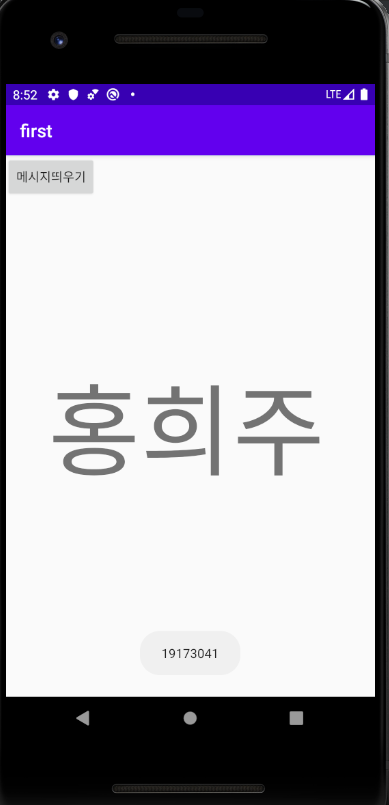
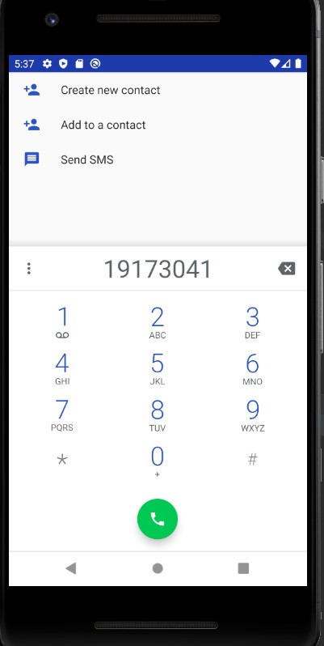
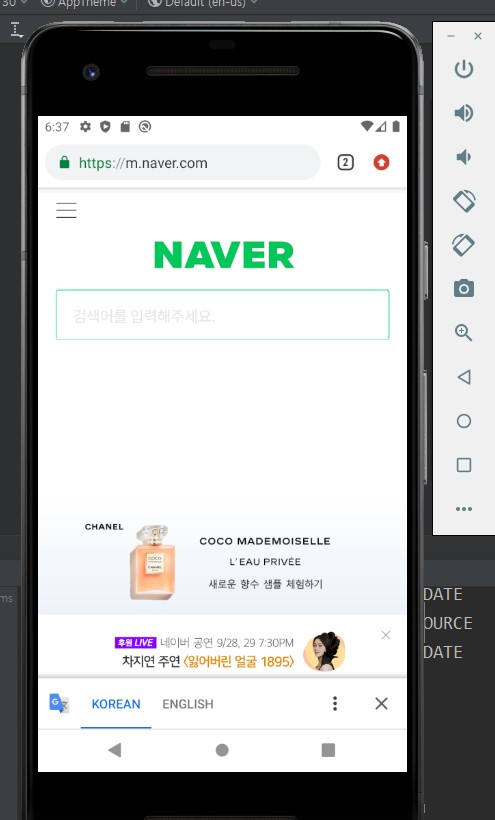

# 19173041 홍희주

## 1주차 과제

## 2주차 과제
</img>

## 3주차 과제
</img>
</img>

## 4주차 과제
-약 먹을 시간을 알려주는 앱-

약을 먹을 시간이지만 깜빡하고 놓칠 때가 있습니다. 그래서 약 먹을 시간을 직접 지정하고
그 시간에 알림이 갑니다. 그렇게 된다면 약을 제때 먹을 수 있도록 도움이 될겁니다.
그 알림을 누르면 먹은 약이 자동으로 다이어리에 체크가 되어 무엇을 먹었는지도
다시 한번 확인 할 수 있습니다. 앱을 사용하는데 있어 복잡하지 않고 딱 필요한 것만 사용 할 수 있는 간편함에
차별성을 둔다.
